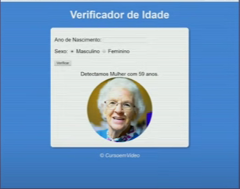

## Imagens

### **para homens e mulheres**

- Criança 0 - 12 
- adolescente 13 - 18
- adulto  19 - 60
- idoso 60+

## colors

- background: #10E1E1

## Exemplos

## excuções 
- coletar a idade do user
- (Teste) Evento de clicar o botão exibir data do user
- calcular a idade do usario em anos nascimento - ano atual 
- Coletar o sexo do radio 
- Modificar a imagem para a imagem de acordo com a idade

- adicionar o limete da data a um ano antes do atual

## Testes
anos
- Criança 2015
- adolescente 2009
- adulto 2000
- idoso 1960